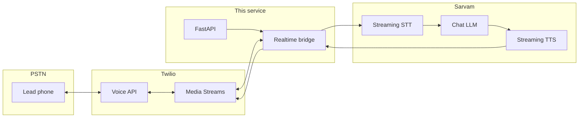

# Sarvam Voice Sales Assistant

A **FastAPI** backend for **consent-gated, campaign-driven outbound sales calls** with a realtime voice loop: **Twilio** (PSTN + Media Streams) on the telephony side, and **Sarvam** (streaming speech-to-text, LLM, streaming text-to-speech) on the AI side. The system is built as a **concierge MVP**—manual approvals, narrow use cases (e.g. appointment booking), and explicit compliance hooks—before scaling to self-serve.

---

## What it does

| Area | Behavior |
|------|----------|
| **Campaign ops** | Create clients and campaigns, import leads from CSV, enforce validation and suppression lists. |
| **Governance** | Campaign and lead **approval gates**; calling only inside configured **local time windows**. |
| **Dialing** | `dial-next` selects queued leads and places outbound calls via Twilio when fully configured; otherwise **dry-run** mode records intent without calling. |
| **Live conversation** | Twilio streams 8 kHz audio to the app; **Sarvam STT** transcribes, **Sarvam LLM** generates replies under campaign guardrails, **Sarvam TTS** returns **mulaw** for Twilio playback. |
| **Barge-in** | Speech-start events from Sarvam can **clear** queued Twilio playback so the callee is not talked over. |
| **Reporting** | Campaign metrics, Twilio status webhooks, and **CSV export** for appointments/callbacks. |

---

## Architecture (high level)



SQLite (`data/app.db`) stores clients, campaigns, leads, calls, and suppression data. See `app/schema.sql` for the full model.

---

## Tech stack

| Layer | Choice |
|--------|--------|
| API | FastAPI, Uvicorn |
| Data | SQLite |
| Telephony | Twilio Voice, TwiML, Media Streams (WebSocket) |
| AI / voice | Sarvam (`sarvamai` SDK): Saaras STT, Sarvam chat model, Bulbul TTS |
| Config | `python-dotenv` loading `secrets/.env` |

---

## Repository layout

| Path | Purpose |
|------|---------|
| `app/` | Application code: HTTP routes, DB, realtime bridge, Sarvam integration, compliance helpers |
| `scripts/` | `bootstrap_demo.py`, `smoke_flow.py`, `api_ping.py` |
| `data/fixtures/` | Sample CSV for demos |
| `docs/` | Roadmap, compliance, provider notes, MVP spec, pilot launch, **INR cost estimates** |
| `tools/unit_economics.py` | Pilot unit-economics calculator (editable assumptions) |
| `secrets/.env.example` | Template for environment variables (copy to `secrets/.env`) |

---

## Documentation

| Document | Contents |
|----------|----------|
| [docs/00-project-roadmap.md](docs/00-project-roadmap.md) | Phased build, deployment, and testing |
| [docs/01-niche-and-offer.md](docs/01-niche-and-offer.md) | ICP, positioning, offer, metrics |
| [docs/02-compliance-playbook.md](docs/02-compliance-playbook.md) | Consent, DNC, opt-out, calling windows, risk controls |
| [docs/03-provider-selection.md](docs/03-provider-selection.md) | Twilio-first; Telnyx cost path |
| [docs/04-mvp-build-spec.md](docs/04-mvp-build-spec.md) | Product, architecture, data model, call flow |
| [docs/05-concierge-pilot-launch.md](docs/05-concierge-pilot-launch.md) | Design-partner launch and cadence |
| [docs/06-voice-cost-estimates-inr.md](docs/06-voice-cost-estimates-inr.md) | Twilio + Sarvam per-minute planning (INR) |

Operational calling must follow applicable law and your [compliance playbook](docs/02-compliance-playbook.md); this software does not replace legal advice.

---

## Prerequisites

- **Python 3.11+** (3.12 matches CI)
- **Twilio** account with Voice and a caller ID / purchased number
- **Sarvam** API key for STT, LLM, and TTS
- For live calls from a laptop: a **public HTTPS URL** (ngrok, Cloudflare Tunnel, etc.) for webhooks and the media WebSocket

---

## Quick start

```powershell
python -m venv .venv
.\.venv\Scripts\Activate.ps1
pip install -r requirements.txt
copy secrets\.env.example secrets\.env
```

Edit `secrets/.env` with real values when you exercise Twilio and Sarvam.

```powershell
python scripts\bootstrap_demo.py
uvicorn app.main:app --reload
```

Open [http://127.0.0.1:8000/docs](http://127.0.0.1:8000/docs) for the interactive OpenAPI UI.

---

## Configuration

All secrets and tunables live in **`secrets/.env`** (gitignored). Summary:

| Variable | Role |
|----------|------|
| `TWILIO_ACCOUNT_SID`, `TWILIO_AUTH_TOKEN` | Twilio REST API |
| `TWILIO_FROM_NUMBER` | Outbound caller ID (E.164) |
| `TWILIO_TO_NUMBER` | Optional; used by `make_call.py` smoke test |
| `PUBLIC_BASE_URL` | Public **https** base (no trailing slash) for Twilio callbacks and `wss` media URL |
| `SARVAM_API_KEY` | Sarvam API |
| `SARVAM_CHAT_MODEL`, `SARVAM_STT_*`, `SARVAM_TTS_*` | Model and language settings |
| `MAX_AGENT_TURN_WORDS` | Caps LLM reply length for phone |
| `DEFAULT_PHONE_REGION`, `DEFAULT_TIMEZONE` | Lead normalization defaults |

See `secrets/.env.example` for comments and defaults.

---

## HTTP API overview

| Method | Path | Description |
|--------|------|-------------|
| `GET` | `/health` | Liveness and DB path |
| `POST` | `/clients` | Create client |
| `POST` | `/campaigns` | Create campaign |
| `POST` | `/campaigns/{id}/approve` | Approve campaign |
| `POST` | `/campaigns/{id}/leads:upload` | Upload leads CSV |
| `POST` | `/campaigns/{id}/leads/approve` | Approve leads |
| `POST` | `/campaigns/{id}/queue` | Queue approved leads |
| `POST` | `/campaigns/{id}/dial-next` | Place next call (or dry-run) |
| `GET` | `/campaigns/{id}/metrics` | Campaign metrics |
| `POST` | `/suppression` | Add suppression entry |
| `GET` | `/exports/campaigns/{id}/appointments.csv` | Export appointments/callbacks |
| `POST` | `/webhooks/twilio/answer` | TwiML + Media Stream URL (Twilio) |
| `POST` | `/webhooks/twilio/status` | Call status callbacks |
| `WS` | `/media/twilio/{call_id}` | Bidirectional audio stream |

---

## Agent behavior (campaign-driven)

Replies are constrained by campaign fields, including:

- **`agent_persona`** — tone and style  
- **`opening_script`** — first utterance; supports `{lead_name}`, `{product_interest}`, `{client_name}`  
- **`offer_summary`**, **`approved_claims`**, **`disallowed_claims`** — what may or may not be said  
- **`qualification_questions`**, **`objection_responses`** — structured discovery and objections  

Example campaigns are seeded by `scripts/bootstrap_demo.py` (solar) and `scripts/bootstrap_assam_tea.py` (Assam Agro Tea).

---

## Brand example: Assam Agro Tea

Pitch copy and guardrails live in the **campaign** row (see [`app/agent.py`](app/agent.py) `build_system_prompt`). This repo includes a ready-made client and campaign:

| ID | Purpose |
|----|---------|
| `client_assam_agro_tea` | Brand record; `name` is **Assam Agro Tea** (used as `{client_name}` in the opening script). |
| `campaign_assam_agro_tea_retail` | Retail / wholesale tea pitch, claims, objections, and booking link placeholder. |

**Seed the database and print the upload command:**

```powershell
python scripts\bootstrap_assam_tea.py
```

**Import leads, approve, queue, and dial** (server running on port 8000):

```powershell
curl -F "file=@data/fixtures/assam_tea_leads.csv" http://127.0.0.1:8000/campaigns/campaign_assam_agro_tea_retail/leads:upload
curl -X POST http://127.0.0.1:8000/campaigns/campaign_assam_agro_tea_retail/approve -H "Content-Type: application/json" -d "{\"approved_by\":\"founder\"}"
curl -X POST http://127.0.0.1:8000/campaigns/campaign_assam_agro_tea_retail/leads/approve
curl -X POST http://127.0.0.1:8000/campaigns/campaign_assam_agro_tea_retail/queue
curl -X POST http://127.0.0.1:8000/campaigns/campaign_assam_agro_tea_retail/dial-next
```

**Automated smoke** (uploads fixture, approves campaign and leads; uses `TWILIO_TO_NUMBER` on the first lead when set):

```powershell
python scripts\smoke_flow_assam.py
```

For Hindi or other Sarvam languages, adjust `SARVAM_STT_LANGUAGE` and `SARVAM_TTS_LANGUAGE` in `secrets/.env` (see `secrets/.env.example`). Set `DEFAULT_PHONE_REGION=IN` and `DEFAULT_TIMEZONE=Asia/Kolkata` when most leads omit a `+` prefix.

---

## End-to-end demo (curl)

```powershell
curl -F "file=@data/fixtures/solar_leads.csv" http://127.0.0.1:8000/campaigns/campaign_demo_solar/leads:upload
curl -X POST http://127.0.0.1:8000/campaigns/campaign_demo_solar/approve -H "Content-Type: application/json" -d "{\"approved_by\":\"founder\"}"
curl -X POST http://127.0.0.1:8000/campaigns/campaign_demo_solar/leads/approve
curl http://127.0.0.1:8000/campaigns/campaign_demo_solar/metrics
```

`POST /campaigns/{campaign_id}/dial-next` uses **dry-run** unless `PUBLIC_BASE_URL`, `TWILIO_FROM_NUMBER`, and Twilio credentials are set.

---

## Live voice test (Twilio + tunnel)

1. Set Twilio and Sarvam keys in `secrets/.env`.  
2. Start a tunnel to port **8000** (ngrok, Cloudflare Tunnel, etc.).  
3. Set `PUBLIC_BASE_URL` to the tunnel’s **https** origin and restart Uvicorn.  
4. Seed and queue:

```powershell
python scripts\bootstrap_demo.py
python scripts\smoke_flow.py
curl -X POST http://127.0.0.1:8000/campaigns/campaign_demo_solar/queue
curl -X POST http://127.0.0.1:8000/campaigns/campaign_demo_solar/dial-next
```

When the call connects, Twilio opens **`/media/twilio/{call_id}`**; audio flows through Sarvam STT → LLM → TTS (mulaw) back to the callee.

---

## Utilities

```powershell
python scripts\api_ping.py --twilio
python scripts\api_ping.py --sarvam-llm
python scripts\smoke_flow_assam.py
python tools\unit_economics.py --minutes 1000
```

---

## Cost planning

Rough **Twilio + Sarvam** per-minute estimates in INR are documented in [docs/06-voice-cost-estimates-inr.md](docs/06-voice-cost-estimates-inr.md). The `tools/unit_economics.py` script models pilot economics in USD with editable assumptions.

---

## Contributing

See [CONTRIBUTING.md](CONTRIBUTING.md).

## Security

See [SECURITY.md](SECURITY.md) for reporting sensitive issues.

## License

This project is licensed under the [MIT License](LICENSE).
