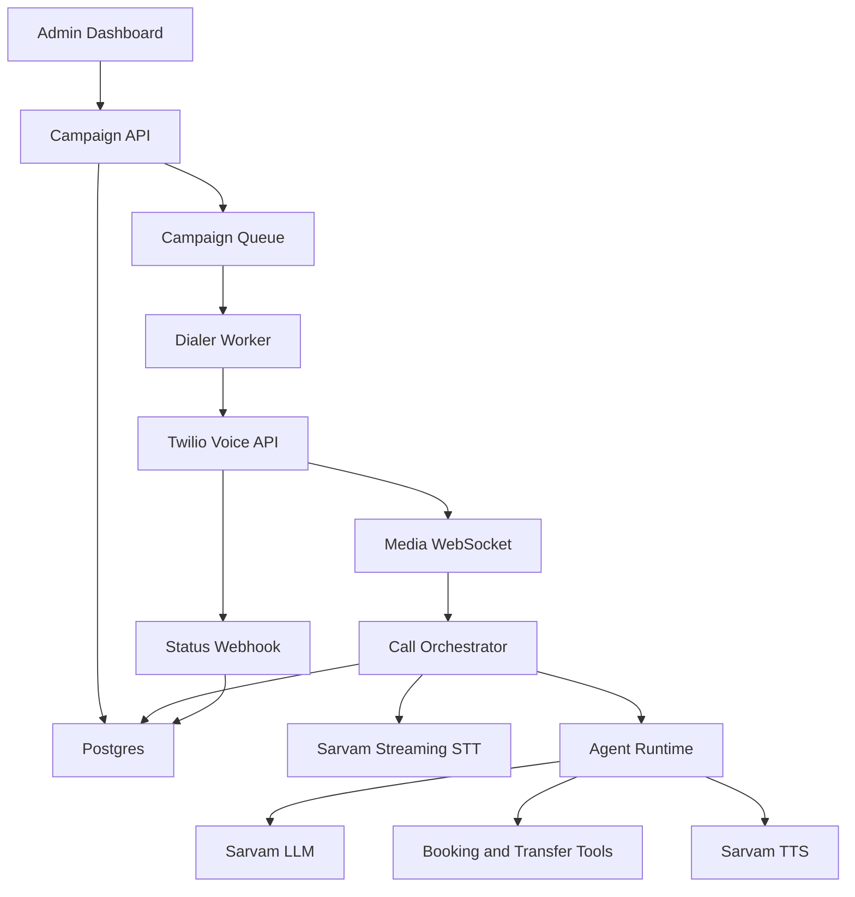
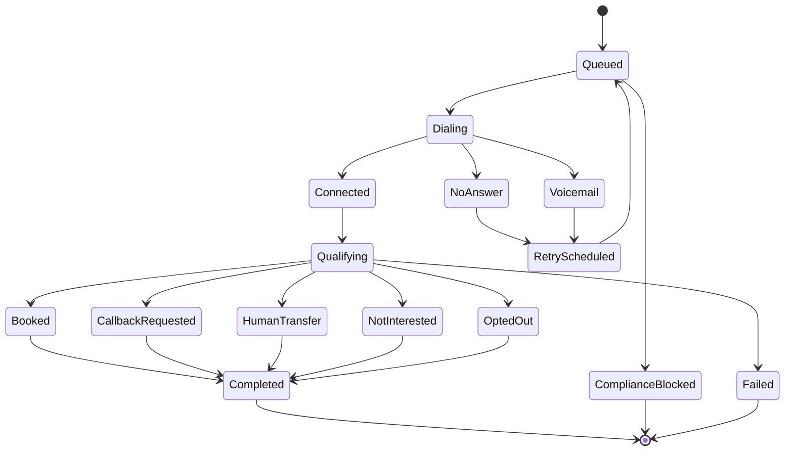

# MVP Build Specification

## Goal

Build a concierge MVP that books appointments from warm leads for local service businesses.

The MVP is not a self-serve SaaS platform yet. Operators can configure campaigns manually, review compliance manually, and export reports manually where needed. The product must still have reliable call-state handling, compliance logging, and outcome tracking from the first paid pilot.

## User Roles

Platform admin:

- Creates clients.
- Reviews campaigns.
- Approves scripts and lead sources.
- Pauses campaigns.
- Reviews risky calls.

Client operator:

- Uploads lead lists.
- Reviews campaign results.
- Listens to recordings if enabled.
- Receives booked appointments and qualified callbacks.

Prospect:

- Receives the call.
- Can ask questions, request a callback, book an appointment, transfer to a human, or opt out.

## Core User Stories

Campaign setup:

- As an admin, I can create a client and campaign.
- As an admin, I can upload leads with consent metadata.
- As an admin, I can define campaign offer, qualifying questions, and approved claims.
- As an admin, I can approve or block a campaign before dialing.

Calling:

- As the system, I only dial leads that pass compliance checks.
- As the system, I call leads during their allowed local time window.
- As the system, I stream call audio to the voice orchestrator.
- As the AI agent, I introduce the client, call purpose, and opt-out path.
- As the AI agent, I qualify the prospect and book or transfer when appropriate.
- As the AI agent, I immediately honor opt-out requests.

Reporting:

- As a client, I can see lead outcomes and transcripts.
- As a client, I can export booked appointments and callback requests.
- As an admin, I can see cost, call volume, and quality review flags.

## System Architecture



## Backend Services

Campaign API:

- CRUD for clients, campaigns, leads, scripts, and outcomes.
- Upload and validate CSV lead files.
- Approve campaigns.
- Pause/resume campaigns.

Compliance service:

- Normalizes phone numbers.
- Checks consent metadata.
- Checks suppression lists.
- Determines local calling windows.
- Writes audit logs.

Dialer worker:

- Pulls approved leads from the queue.
- Enforces campaign rate limits.
- Creates Twilio outbound calls.
- Schedules retries.
- Marks terminal lead states.

Call orchestrator:

- Maintains live call state.
- Receives media stream events.
- Streams caller audio to Sarvam STT.
- Sends transcript turns to the agent runtime.
- Handles interruption and silence.
- Sends generated audio back to the call provider.

Agent runtime:

- Builds prompt context from campaign, lead, and conversation state.
- Enforces approved claims and disallowed behavior.
- Calls booking/transfer tools when needed.
- Produces structured call outcomes.

Analytics service:

- Aggregates funnel metrics.
- Computes cost per conversation and booked appointment.
- Produces client exports.

## Suggested Technology Stack

Backend:

- Python FastAPI for HTTP APIs and WebSocket endpoints.
- Celery, RQ, or Dramatiq for dialer workers.
- Redis for active call/session state and queues.
- Postgres for durable campaign data.

Frontend:

- Next.js or a simple admin UI.
- Use server-rendered pages first; avoid overbuilding complex real-time dashboards.

Infrastructure:

- Railway, Render, Fly.io, or a small VPS for pilot hosting.
- Managed Postgres from Supabase, Neon, Railway, or Render.
- Sentry for errors before paid pilot.

## Data Model

`clients`:

- `id`
- `name`
- `industry`
- `billing_email`
- `handoff_phone`
- `timezone_default`
- `created_at`

`campaigns`:

- `id`
- `client_id`
- `name`
- `status`
- `offer_summary`
- `goal`
- `approved_claims`
- `disallowed_claims`
- `ai_disclosure_mode`
- `recording_mode`
- `calling_window_start`
- `calling_window_end`
- `max_attempts`
- `approval_status`
- `approved_by`
- `approved_at`

`leads`:

- `id`
- `client_id`
- `campaign_id`
- `full_name`
- `phone_e164`
- `timezone`
- `lead_source`
- `consent_status`
- `consent_timestamp`
- `consent_text_or_url`
- `product_interest`
- `status`
- `attempt_count`
- `last_attempt_at`
- `suppressed_at`

`calls`:

- `id`
- `client_id`
- `campaign_id`
- `lead_id`
- `provider`
- `provider_call_id`
- `started_at`
- `ended_at`
- `duration_seconds`
- `local_time_at_dial`
- `status`
- `outcome`
- `opt_out_detected`
- `transferred`
- `recording_url`
- `cost_estimate_usd`

`conversation_turns`:

- `id`
- `call_id`
- `speaker`
- `text`
- `started_at_ms`
- `ended_at_ms`
- `confidence`

`suppression_entries`:

- `id`
- `client_id`
- `phone_e164`
- `reason`
- `source_call_id`
- `created_at`

`audit_logs`:

- `id`
- `actor_type`
- `actor_id`
- `action`
- `entity_type`
- `entity_id`
- `metadata_json`
- `created_at`

## Call State Machine



## Agent Prompt Contract

System rules:

- You are an AI assistant calling on behalf of the client.
- Your goal is to book a qualified appointment or request a callback.
- Identify the client and reason for the call early.
- Do not pretend to be human.
- Do not claim guarantees, discounts, certifications, or availability unless they appear in approved claims.
- Do not ask for sensitive personal data.
- If the prospect asks to stop, remove them, or not be called, acknowledge and trigger opt-out.
- If the prospect is angry, confused, or reports a wrong number, end politely.
- Keep turns short enough for a phone call.

Campaign context:

- Client name.
- Offer.
- Lead source.
- Qualification questions.
- Approved claims.
- Disallowed claims.
- Booking link or transfer phone.
- Objection responses.

Tool outputs:

- `book_appointment(date_time, notes)`
- `request_callback(date_time, notes)`
- `transfer_to_human(reason)`
- `mark_do_not_call(reason)`
- `mark_not_interested(reason)`
- `end_call(reason)`

Structured final outcome:

```json
{
  "outcome": "booked|callback_requested|qualified|not_interested|opted_out|bad_number|voicemail|failed",
  "qualification_summary": "short summary",
  "next_action": "calendar_invite|client_follow_up|none",
  "risk_flags": ["unapproved_claim", "angry_customer", "sensitive_data"]
}
```

## Dashboard Scope

MVP admin pages:

- Clients.
- Campaigns.
- Lead import.
- Campaign approval checklist.
- Calls and transcripts.
- Suppression list.
- Campaign metrics.

MVP client pages:

- Campaign summary.
- Booked appointments.
- Callback requests.
- Call transcripts.
- CSV export.

Metrics to show:

- Leads uploaded.
- Leads dialable.
- Calls attempted.
- Connected calls.
- Average call duration.
- Booked appointments.
- Qualified callbacks.
- Opt-outs.
- Estimated cost.
- Estimated cost per booked appointment.

## API Endpoint Sketch

Campaigns:

- `POST /clients`
- `POST /campaigns`
- `POST /campaigns/{id}/leads:upload`
- `POST /campaigns/{id}/approve`
- `POST /campaigns/{id}/pause`
- `GET /campaigns/{id}/metrics`

Calling:

- `POST /webhooks/twilio/status`
- `POST /webhooks/twilio/answer`
- `WS /media/twilio/{call_id}`

Operations:

- `GET /calls`
- `GET /calls/{id}`
- `POST /calls/{id}/review`
- `POST /suppression`
- `GET /exports/campaigns/{id}/appointments.csv`

## Latency Budget

Target mouth-to-ear response gap:

- Good: under 900 ms after end-of-speech.
- Acceptable MVP: under 1.5 seconds.
- Poor: above 2 seconds.

Practical controls:

- Stream STT partials.
- Generate short responses.
- Send partial LLM text to TTS where possible.
- Cache campaign prompt context.
- Avoid large tools or CRM calls in the middle of a spoken turn.
- Interrupt TTS playback when the prospect starts speaking.

## Acceptance Criteria

Technical:

- 100 internal test calls can complete without backend crashes.
- At least 95% of call status webhooks are reconciled to a lead.
- Opt-out phrases are detected in test transcripts.
- Calls outside allowed windows are blocked.
- Average response latency is measured and reported.

Business:

- One approved campaign can run from lead upload to booked appointment export.
- Campaign cost can be estimated with `tools/unit_economics.py`.
- Client can review outcomes and transcripts.

Compliance:

- Unknown-source leads are blocked.
- Suppression entries block future calls.
- Campaigns cannot dial before approval.
- Audit logs exist for lead upload, approval, dialing, and opt-out.

## Build Order

1. Keep the existing Twilio smoke test working.
2. Add database schema and lead import.
3. Add campaign approval and compliance checks.
4. Add outbound call creation with status webhook storage.
5. Add Media Streams WebSocket logging.
6. Connect Sarvam STT.
7. Add agent runtime and Sarvam TTS.
8. Add opt-out, booking, callback, and transfer tools.
9. Add dashboard/reporting pages.
10. Run internal test-call suite before client pilots.
